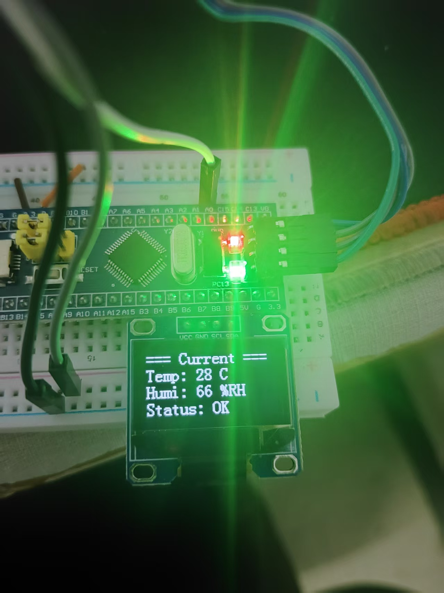
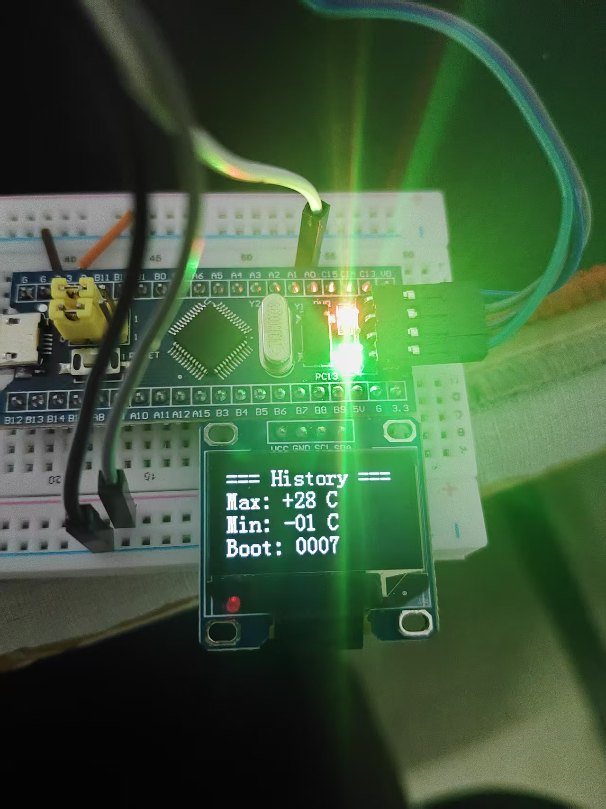
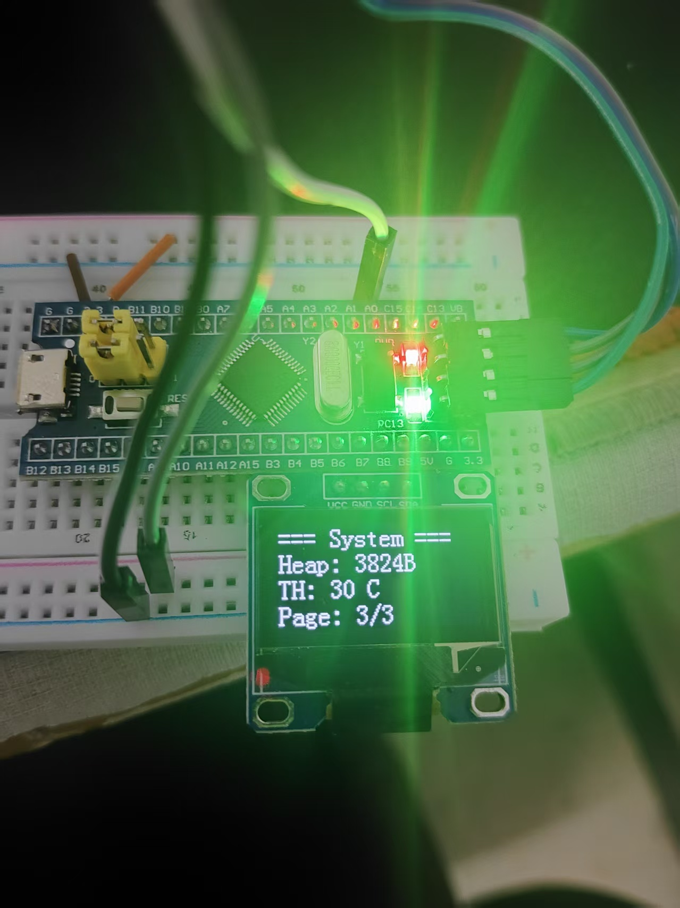

# 基于 FreeRTOS 的微型环境监控终端

[](LICENSE)
[](https://www.st.com/)
[](https://www.freertos.org/)

## 项目简介

本项目基于 **STM32F103C8T6** 和 **FreeRTOS**，搭建了 BSP 驱动层、RTOS 内核层和应用逻辑层的三层软件架构。实现了 DHT11 温湿度采集、OLED 三页面自动轮播 UI，并通过 **内部 Flash 模拟 EEPROM** 实现了启动计数和报警阈值的掉电非易失存储。

##  硬件平台

| 组件 | 型号/规格 |
| :--- | :--- |
| MCU | STM32F103C8T6 (Cortex-M3, 72MHz) |
| 传感器 | DHT11 (单总线协议) |
| 显示 | 0.96寸 OLED (I2C接口, SSD1306) |
| 板载 LED | PC13 (低电平点亮) |
| 调试接口 | SWD (ST-Link) |

## 功能特性

-  **FreeRTOS 多任务调度**：3 个独立任务（传感器采集 / OLED显示 / LED心跳），优先级分级管理
-  **消息队列 (Queue)**：实现任务间异步数据传递，解耦生产者和消费者
-  **内部 Flash 模拟 EEPROM**：
  - 启动计数器（每次上电/复位自动 +1）
  - 报警阈值断电保存（默认 30℃，可修改）
-  **OLED 三页面自动轮播**（每 5 秒切换）：
  - 页面0：当前温湿度 + 报警状态
  - 页面1：历史最高/最低温度 + Boot 计数
  - 页面2：FreeRTOS 堆剩余大小 + 当前阈值 + 页码
-  **超阈值 LED 快闪报警**：温度 > 阈值时 LED 从 1秒慢闪 切换为 200ms 快闪
-  **栈溢出检测**：开启 `configCHECK_FOR_STACK_OVERFLOW 2`，异常时 LED 常亮提示

## 软件架构
```text
STM32-FreeRTOS-Env-Monitor/
├── BSP/               # 硬件驱动层
│   ├── bsp_oled.c/.h
│   ├── bsp_dht11.c/.h
│   └── bsp_flash.c/.h
├── User/              # 应用逻辑层
│   ├── main.c
│   └── stm32f10x_it.c
├── FreeRTOS/          # RTOS 内核
│   ├── include/
│   ├── src/
│   ├── port/
│   └── mem/
└── System/            # 系统工具层
    ├── Delay.c/.h
    └── timer.c/.h
```

## 运行效果（实拍图）
| 页面0（当前值） | 页面1（历史极值） | 页面2（系统信息） |
| :---: | :---: | :---: |
|  |  |  |
| 实时温度/湿度 + **Status:ALARM!**<br>（展示超阈值报警功能） | 历史最高/最低温 + Boot 计数<br>（展示 Flash 保存的历史极值和开机次数） | FreeRTOS 堆大小 + 阈值 TH + 页码 3/3<br>（展示 RTOS 系统运行参数） |
## 接线说明

| 外设 | 引脚 | 说明 |
| :--- | :--- | :--- |
| OLED SCL | PB8 | I2C 时钟线 |
| OLED SDA | PB9 | I2C 数据线 |
| DHT11 DATA | PA0 | 单总线数据线 |
| 板载 LED | PC13 | 低电平点亮 |
| 调试接口 | SWD (PA13, PA14) | ST-Link 烧录 |

## 开发环境

| 工具 | 版本 |
| :--- | :--- |
| IDE | Keil MDK 5.06 |
| 编译器 | ARMCC V5.06 update 5 (build 528) |
| 标准库 | STM32F10x_StdPeriph_Driver V3.5.0 |
| RTOS | FreeRTOS V9.0.0 |

## 快速开始

1. **克隆仓库**：
   ```bash
   git clone https://github.com/QD25-ct/STM32-FreeRTOS-Env-Monitor.git
