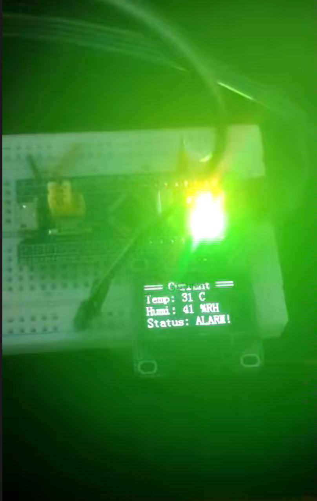
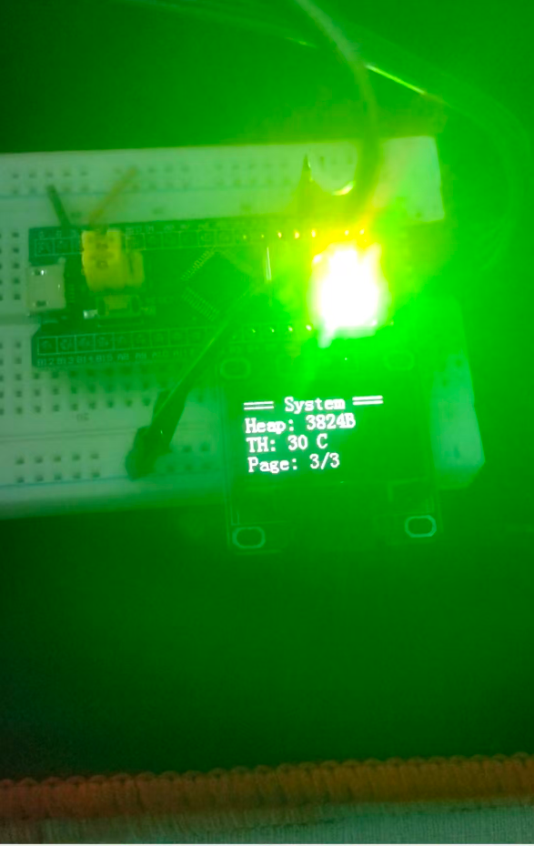

# STM32‑FreeRTOS‑Env‑Monitor
基于STM32F103C8T6 + FreeRTOS 的嵌入式环境监控终端。

## 项目简介
本项目实现DHT11温湿度采集、OLED屏幕多页面轮转显示、阈值报警、参数掉电保存功能。采用FreeRTOS多任务架构，任务之间通过消息队列传递数据，开启栈溢出检测，完成BSP驱动分层，工程目录规范化，使用Git做版本管理。

## 硬件平台
- MCU：STM32F103C8T6
- 传感器：DHT11温湿度模块
- 显示：0.96寸 I2C OLED（SSD1306）
- 外设：LED报警指示灯

## 运行效果
| 历史极值页面 | 当前温湿度页面 | 系统信息页面 |
| :---: | :---: | :---: |
|  |  |  |

> 功能说明：OLED三页自动循环切换；
> - 历史极值页：记录最大最小温度、Flash保存的设备启动次数；
> - 当前温湿度页：实时采集DHT11数据，温度超限显示ALARM报警状态；
> - 系统信息页：展示FreeRTOS堆内存、报警阈值、页面编号；
> 片内Flash模拟EEPROM保存启动计数与报警阈值，超阈值触发LED快速闪烁报警。

## 主要功能
1. DHT11周期采集环境温度、湿度数据，做校验容错处理
2. OLED多页面自动轮转：实时数值、历史最大/最小极值、系统堆栈与启动计数
3. Flash模拟EEPROM，实现启动计数、报警阈值断电保存
4. 超阈值触发LED闪烁报警
5. FreeRTOS消息队列实现多任务解耦通信
6. 开启任务栈溢出检测，提升系统稳定性

## 工程目录
├── BSP // BSP 底层硬件驱动
├── system // 系统定时器、底层工具
├── User // FreeRTOS 任务、业务逻辑
├── freertos // FreeRTOS 内核源码
├── Hardware // 外设硬件相关
├── Library // STM32 标准库
├── Start // 启动文件
├── Images // 实物运行效果图
├── Project.uvprojx // Keil 工程文件
└── README.md // 项目文档

## 编译环境
Keil MDK‑ARM5

## 使用说明
1. Keil打开`Project.uvprojx`工程
2. 编译下载到STM32F103C8T6开发板
3. 上电运行，OLED自动循环切换页面；温度超限LED报警。

<!-- 后续录完视频，把链接替换进来
## 演示视频
[B站演示链接](https://xxx)
演示：复位启动计数累加，手捏DHT11触发超温报警。
-->
